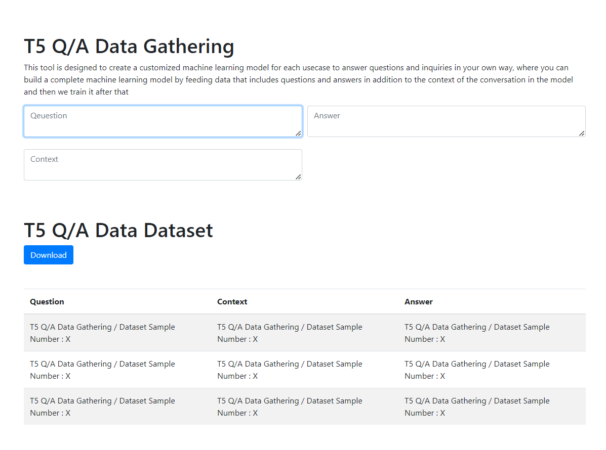

<h1>NLP Platform for Data Gathering (Q/A T5 Model Fine tuninning)</h1>

In this project, we will feed the model with text data to solve the questions and answers problem using the t5 form. At first, we will work on collecting the data and converting it to a csv file, then we will work on training the model on this file, then we will create an api. The goal is to create a complete modified model to solve the problem Specific tasks such as customer service, answering questions, chatbots, and other tasks

